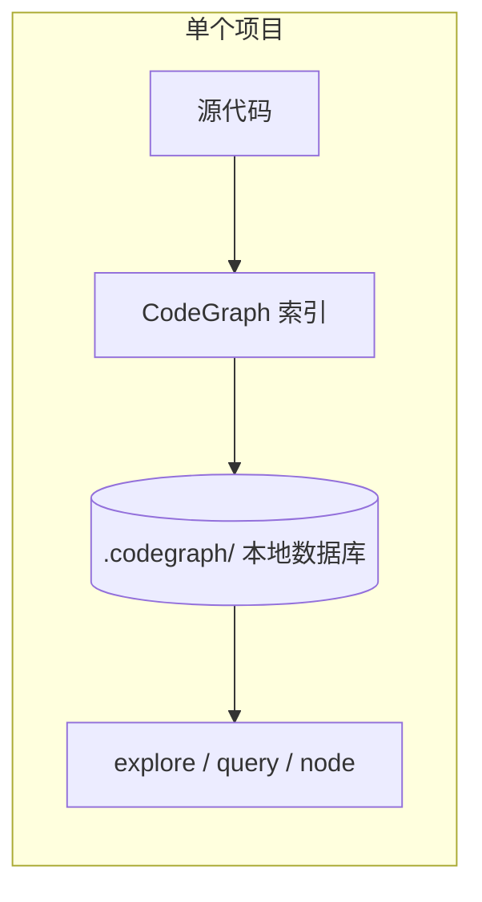

# CodeGraph 多仓库分层架构 — 现状对比与完整方案设计

> **日期**: 2026-06-29
> **CodeGraph 版本**: v1.1.3 (`@colbymchenry/codegraph`)
> **目标仓库**: AOSP (`android-13.0.0_r43`，1,206 个 Git 仓库，~647,000 代码文件)

---

## 目录

1. [AOSP 仓库规模概述](#1-aosp-仓库规模概述)
2. [CodeGraph 现状能力分析](#2-codegraph-现状能力分析)
3. [目标方案完整描述](#3-目标方案完整描述)
4. [逐项对比：现状 vs 目标](#4-逐项对比现状-vs-目标)
5. [差距总结](#5-差距总结)
6. [完整方案所需修改](#6-完整方案所需修改)
7. [实施路径建议](#7-实施路径建议)

---

## 1. AOSP 仓库规模概述

```
总 Git 仓库数：   1,206 个
代码文件数：      ~647,000 个
基础版本：        android-13.0.0_r43
管理工具：        Google repo（git 多仓管理）
索引存储位置：    每个 git 仓库根目录 /.codegraph/

按一级模块分布（Top 10）：

  external      645 个仓库 (53%)   ← 第三方库
  packages      132 个仓库 (11%)   ← 系统应用
  hardware       80 个仓库 (7%)    ← 硬件抽象
  device         78 个仓库 (6%)    ← 设备配置
  prebuilts      60 个仓库 (5%)    ← 预编译文件
  system         53 个仓库 (4%)    ← 系统服务
  frameworks     36 个仓库 (3%)    ← 核心框架
  vendor         33 个仓库 (3%)    ← 厂商定制
  tools          24 个仓库 (2%)    ← 开发工具
  kernel         24 个仓库 (2%)    ← 内核

仓库嵌套层级示例：

  civ13/
  ├── art/                         ← 1 个仓库
  ├── frameworks/
  │   ├── base/                    ← 独立仓库
  │   ├── native/                  ← 独立仓库
  │   └── ... (共 36 个)
  ├── system/
  │   ├── core/                    ← 独立仓库
  │   └── ... (共 53 个)
  └── external/
      ├── compiler-rt/             ← 独立仓库
      └── ... (共 645 个)
```

---

## 2. CodeGraph 现状能力分析

### 2.1 架构模型



CodeGraph 当前为**单一封闭图**架构：

- `codegraph init <path>` 为一个项目目录构建自包含的符号图和调用图
- 索引存储在该项目根目录的 `.codegraph/` 下
- 所有查询（`explore`、`query`、`node`、`callers`、`callees`、`impact`）严格限定在当前仓库范围内

### 2.2 节点与边模型

```typescript
// 节点类型（代码符号）
type NodeKind = "file" | "module" | "class" | "struct" | "interface"
              | "trait" | "protocol" | "function" | "method" | "property"
              | "field" | "variable" | "constant" | "enum" | "enum_member"
              | "type_alias" | "namespace" | "parameter" | "import" | "export"
              | "route" | "component";

// 边的类型（关系）
type EdgeKind = "contains" | "calls" | "imports" | "exports"
              | "extends" | "implements" | "references" | "type_of"
              | "returns" | "instantiates" | "overrides" | "decorates";

// 符号可见性（已内置但未用于跨仓库过滤）
interface Node {
    visibility?: "public" | "private" | "protected" | "internal";
    isExported?: boolean;
    // ...
}
```

### 2.3 已有但未利用的扩展点

| 模块 | 文件 | 状态 |
|------|------|------|
| `workspace-packages` | `resolution/workspace-packages.js` | 仅骨架，无跨仓库逻辑 |
| `project-config` | `project-config.js` + `codegraph.json` | 仅支持 `extensions`/`includeIgnored`/`exclude` |
| `visibility` 字段 | `types.d.ts` Node 类型 | 已定义但仅在单仓库内使用 |

### 2.4 CLI 与 MCP 工具清单

| 命令/工具 | 作用 | 是否支持跨仓库 |
|-----------|------|----------------|
| `init` | 初始化项目索引 | ❌ 仅单仓库 |
| `index` | 重建全量索引 | ❌ 仅单仓库 |
| `sync` | 增量同步变更 | ❌ 仅单仓库 |
| `status` | 索引状态统计 | ❌ 仅单仓库 |
| `query` | 符号搜索 | ❌ 仅单仓库 |
| `explore` | 语义搜索 + 调用路径 | ❌ 仅单仓库 |
| `node` | 单符号调用链 | ❌ 仅单仓库 |
| `callers` | 查找调用者 | ❌ 仅单仓库 |
| `callees` | 查找被调用者 | ❌ 仅单仓库 |
| `impact` | 变更影响分析 | ❌ 仅单仓库 |
| `files` | 文件结构 | ❌ 仅单仓库 |

---

## 3. 目标方案完整描述

### 3.1 核心架构：轻量全局索引 + 按需局部子图

```
┌─────────────────────────────────────────────────────────────────┐
│                   MASTER CodeGraph (轻量全局层)                    │
│                                                                   │
│  只存储：                                                          │
│  • 各子仓库的公开 API 符号（类、方法、接口）                          │
│  • 跨仓库调用边（谁调用谁的哪个公开符号）                             │
│  • 每个符号所属的仓库标注                                            │
│                                                                   │
│  不存储：                                                          │
│  • 私有函数/变量的内部实现细节                                       │
│  • 仓库内部的局部调用链                                             │
│                                                                   │
│  规模：节点数控制在万级，查询极快                                     │
└───────────┬──────────┬──────────┬──────────┬──────────────────────┘
            │          │          │          │
     ┌──────▼──┐  ┌───▼───┐  ┌──▼────┐  ┌──▼─────┐
     │  art/   │  │framew.│  │system/│  │ext./   │  ... (1,206 个)
     │ .cg/    │  │ .cg/  │  │ .cg/  │  │ .cg/   │
     │         │  │       │  │       │  │        │
     │ 完整图   │  │完整图  │  │完整图  │  │完整图   │
     │ (重量)  │  │(重量) │  │(重量) │  │(重量)  │
     └─────────┘  └───────┘  └───────┘  └────────┘

     LOCAL SubGraphs (局部子仓库层) — 按需加载
```

### 3.2 查询流程

```
用户查询："ActivityManager 的 startActivity 被哪些模块调用？"

  ① 全局 Master 图查询
     └→ 定位符号: frameworks/base::ActivityManager.startActivity
     └→ 发现调用者: packages/apps/Settings, packages/apps/Launcher3, ...

  ② 定位目标仓库
     └→ frameworks/base, packages/apps/Settings, packages/apps/Launcher3

  ③ 按需加载局部子图
     └→ 加载 frameworks/base/.codegraph/ → 深入 startActivity 内部实现
     └→ 加载 packages/apps/Settings/.codegraph/ → 追踪调用链细节
     └→ 加载 packages/apps/Launcher3/.codegraph/ → 追踪调用链细节

  ④ 合并结果返回
```

### 3.3 规模控制手段

| 手段 | 说明 |
|------|------|
| 聚合包级依赖 | 将类级调用聚合为包级依赖边，减少边数 |
| 去重相似调用 | 同一模块多次调用合并为权重边 |
| 仅存最新快照 | 历史版本变更另行管理 |
| 全局增量更新 | 子仓库变更时，只更新受影响的全局条目 |

---

## 4. 逐项对比：现状 vs 目标

### 4.1 架构层

| 能力 | 目标方案 | CodeGraph 现状 | 差距 |
|------|---------|---------------|------|
| **多仓库索引** | 每个 git 仓库独立 `.codegraph/` | 支持 `init <path>` | ✅ 满足 |
| **Master 全局图** | 轻量聚合层，只存公开 API + 跨仓库边 | **不存在** | ❌ 核心缺失 |
| **子图按需加载** | 查询时动态加载目标仓库局部图 | 每个索引独立封闭 | ❌ 核心缺失 |
| **分层数据模型** | 全局-局部两层，互引不互含 | 无分层概念 | ❌ 核心缺失 |

### 4.2 符号层级

| 能力 | 目标方案 | CodeGraph 现状 | 差距 |
|------|---------|---------------|------|
| **公开/私有符号区分** | 公开 API 提升到全局，私有符号留在局部 | 有 `visibility`/`isExported` 字段 | ⚠️ 字段存在但不跨仓库使用 |
| **跨仓库符号引用** | `packages/apps/Settings` 引用 `frameworks/base::Activity` | 只有同仓库内的引用边 | ❌ 缺失 |
| **符号→仓库映射** | 每个全局符号标注所属仓库 | 无仓库标识 | ❌ 缺失 |

### 4.3 调用边层级

| 能力 | 目标方案 | CodeGraph 现状 | 差距 |
|------|---------|---------------|------|
| **跨仓库调用边** | `repo_A::funcX` → calls → `repo_B::funcY` | **不存在** | ❌ 核心缺失 |
| **动态调度追踪** | 虚函数/接口调用的实际跳转目标 | 有 `overrides`/`implements` 边但不跨仓库 | ⚠️ 单仓库内部分支持 |
| **边聚合/去重** | 包级聚合减少 Master 图规模 | 无聚合机制 | ❌ 缺失 |

### 4.4 查询层级

| 能力 | 目标方案 | CodeGraph 现状 | 差距 |
|------|---------|---------------|------|
| **全局符号搜索** | 在所有仓库的公开 API 中搜索 | 仅当前仓库 | ❌ 缺失 |
| **跨仓库调用链** | 追踪跨仓库的完整调用路径 | 仅在单仓库内 | ❌ 缺失 |
| **影响范围分析** | 修改一个 API 影响哪些仓库 | `impact` 仅单仓库 | ❌ 缺失 |
| **分层查询** | 先全局定位 → 局部深入 | 单步查询 | ❌ 缺失 |

### 4.5 更新机制

| 能力 | 目标方案 | CodeGraph 现状 | 差距 |
|------|---------|---------------|------|
| **单仓库增量同步** | 文件变更后自动同步 | `sync` 支持 | ✅ 满足 |
| **子仓库级索引管理** | 增删子仓库 | `init`/`uninit` 支持 | ✅ 满足 |
| **全局图增量更新** | 子仓库变更后只更新受影响的全局边 | **不存在** | ❌ 核心缺失 |
| **全量重建避免** | 不因单个仓库变更触发全局重建 | **不存在** | ❌ 缺失 |

---

## 5. 差距总结

```
                       CodeGraph 现状支持度

  ✅ 单仓库索引 (init/index/sync/status)
  ✅ 符号提取 + 调用图构建 (18种符号类型, 12种边类型)
  ✅ 语义搜索 (explore)
  ✅ 本地文件存储 (.codegraph/)

  ⚠️ visibility 字段已定义但未跨仓库使用

  ❌ Master 全局聚合图 — 完全不存在
  ❌ 跨仓库调用边 — 完全不存在
  ❌ 按需子图加载协议 — 完全不存在
  ❌ 全局→局部分层查询 — 完全不存在
  ❌ 符号→仓库映射 — 完全不存在
  ❌ 全局增量更新 — 完全不存在
```

**结论：CodeGraph v1.1.3 仅能满足最底层（单仓库局部索引）的需求，缺少整个上层架构。**

---

## 6. 完整方案所需修改

### 6.1 CodeGraph 本体需要新增的模块

```
codegraph/
├── dist/
│   ├── federation/                     ← 新增模块
│   │   ├── master-graph.ts             ← Master 图数据结构
│   │   ├── cross-repo-edges.ts         ← 跨仓库边提取与存储
│   │   ├── public-api-extractor.ts     ← 公开 API 符号提取器
│   │   ├── workspace-scanner.ts        ← 多仓库扫描与发现
│   │   ├── query-router.ts             ← 分层查询路由器
│   │   └── incremental-sync.ts         ← 全局增量同步
│   └── ...
├── codegraph.json                      ← 扩展配置
│   {
│     "workspace": {                     ← 新增 workspace 配置
│       "type": "multi-repo",
│       "root": "/root/civ13",
│       "repos": ["art/", "frameworks/*", ...]
│     },
│     "masterGraph": {                   ← 新增 Master 图配置
│       "enabled": true,
│       "store": ".codegraph-master/"
│     }
│   }
```

### 6.2 新增数据模型

#### 6.2.1 Master Graph 节点

```typescript
/**
 * Master Graph 中的全局节点（轻量版）
 * 只包含公开 API 符号和跨仓库关系
 */
interface MasterNode {
    id: string;                    // 符号唯一标识
    name: string;                  // 简单名称
    qualifiedName: string;         // 全限定名
    kind: NodeKind;                // 符号类型
    sourceRepo: string;            // ★ 所属仓库路径
    repoRelativePath: string;      // ★ 仓库内相对路径
    visibility: 'public';          // Master 图只存 public
    signature?: string;            // 函数签名
    docstring?: string;            // 文档字符串
}
```

#### 6.2.2 跨仓库边

```typescript
/**
 * 跨仓库调用边
 * 连接来自不同仓库的符号
 */
interface CrossRepoEdge {
    sourceNodeId: string;          // 调用方符号
    targetNodeId: string;          // 被调用方符号
    sourceRepo: string;            // 调用方所在仓库
    targetRepo: string;            // 被调用方所在仓库
    kind: EdgeKind;                // 边类型（calls, imports, extends 等）
    weight?: number;               // 调用次数（去重聚合后）
    lastUpdated: number;           // 最后更新时间戳
}
```

### 6.3 新增 CLI 命令

```bash
# 工作区管理
codegraph workspace init <root>           # 扫描 root 下所有 git 仓库并初始化
codegraph workspace status                # 查看整体索引状态
codegraph workspace add <repo-path>       # 添加新仓库
codegraph workspace remove <repo-path>    # 移除仓库

# Master 图管理
codegraph master build                    # 构建 Master 全局聚合图
codegraph master status                   # Master 图状态
codegraph master sync                     # 增量更新 Master 图

# 跨仓库查询
codegraph xref <symbol>                   # 跨仓库引用查找
codegraph xcallers <symbol>               # 跨仓库调用者查找
codegraph ximpact <symbol>                # 跨仓库影响范围分析
```

### 6.4 新增 MCP 工具

```typescript
// 当前已有的工具
"codegraph_explore"    // 单仓库探索 — 保留
"codegraph_node"       // 单仓库节点 — 保留

// 需要新增的工具
"codegraph_xref"       // 全局符号搜索 + 调用链
"codegraph_master"     // Master 图查询
"codegraph_locate"     // 定位符号所属仓库
```

### 6.5 全局增量同步算法伪代码

```
function master_incremental_sync(changed_repo):
    # 1. 提取变更仓库的公开 API 符号变化
    added_symbols, removed_symbols, modified_symbols = extract_public_api_diff(changed_repo)

    # 2. 更新 Master 图中的符号节点
    master_graph.remove_nodes(removed_symbols)
    master_graph.upsert_nodes(added_symbols + modified_symbols)

    # 3. 重新扫描跨仓库边（只扫描与变更仓库相关的边）
    affected_repos = find_dependent_repos(changed_repo)

    for repo in affected_repos:
        # 检查 repo 中是否有符号引用了 changed_repo 的公开 API
        new_edges = extract_cross_repo_edges(repo, changed_repo)
        master_graph.upsert_edges(new_edges)

    # 4. 清理失效边
    master_graph.remove_stale_edges()

    # 5. 提交更新
    master_graph.commit()
```

### 6.6 分层查询流程图

```
用户查询
    │
    ▼
┌─────────────────────────────┐
│  QueryRouter.analyze(query)  │
│  判断是否需要跨仓库查询       │
└─────────────┬───────────────┘
              │
    ┌─────────┴──────────┐
    │                    │
    ▼                    ▼
┌────────┐        ┌──────────────┐
│ 单仓库  │        │   跨仓库查询   │
│ (现有)  │        └──────┬───────┘
└────────┘               │
                  ┌───────▼────────┐
                  │ Master Graph    │  ← 轻量全局查询
                  │ 定位符号+仓库   │     万级节点，毫秒级
                  └───────┬────────┘
                          │
                  ┌───────▼────────┐
                  │ 按需加载局部子图 │  ← 只加载目标仓库
                  │ art/.codegraph/ │     的完整图
                  │ frame/.codegraph│
                  └───────┬────────┘
                          │
                  ┌───────▼────────┐
                  │  合并结果返回   │
                  └────────────────┘
```

---

## 7. 实施路径建议

### 阶段 0：基础验证（已放弃）

> 尝试在当前 CodeGraph v1.1.3 上实施 → **不可行**，缺少整个上层架构。

### 阶段 1：CodeGraph 上游改造（建议推动方向）

| 优先级 | 改造项 | 说明 |
|--------|--------|------|
| P0 | `workspace/multi-repo` 发现机制 | 扫描 root 下所有 git 仓库，建立仓库清单 |
| P0 | `master-graph` 数据结构 | 轻量全局图节点和边的存储格式 |
| P0 | `public-api-extractor` | 从各仓库提取公开 API 符号 |
| P1 | `cross-repo-edges` 提取 | 解析 import/call 关系确定跨仓库边 |
| P1 | `query-router` 分层查询 | 全局→局部的查询路由逻辑 |
| P2 | `incremental-sync` 增量更新 | 避免全量重建 Master 图 |
| P2 | MCP 工具扩展 | `codegraph_xref`、`codegraph_master` 等 |

### 阶段 2：AOSP 专用适配脚本（可选替代方案）

如果无法推动 CodeGraph 上游改造，可以考虑在 CodeGraph 外层构建适配层：

```
┌─────────────────────────────────────┐
│         AOSP CodeGraph Adapter       │  纯脚本层（Python/Shell）
│                                      │
│  • 对每个仓库运行 codegraph init      │
│  • 提取公开 API 汇总到 SQLite/JSON    │  ← 轻量全局索引
│  • 构建符号→仓库映射表               │
│  • 实现查询路由：查表定位 → 调 CG     │
└─────────────────────────────────────┘
```

但此方案无法获取跨仓库调用边（因为需要 CodeGraph 本身感知跨仓库 import），只能实现"全局符号搜索 + 定位仓库"的弱化版本。

---

## 附录：相关 CodeGraph 源码文件

| 文件 | 路径 |
|------|------|
| 类型定义 | `lib/dist/types.d.ts` |
| 项目配置 | `lib/dist/project-config.d.ts` |
| Workspace Packages | `lib/dist/resolution/workspace-packages.d.ts` (骨架) |
| MCP 工具定义 | `lib/dist/mcp/tools.d.ts` |
| 主入口 | `lib/dist/index.d.ts` |

---

> **最终结论**: CodeGraph v1.1.3 是一款优秀的**单仓库**代码智能工具，但不具备多仓库分层架构所需的 Master 图聚合、跨仓库边追踪、分层查询路由等核心能力。当前建议**暂停直接实施**，等待上游支持 workspace 模式，或评估在 CodeGraph 之上构建薄适配层的投入产出比。
